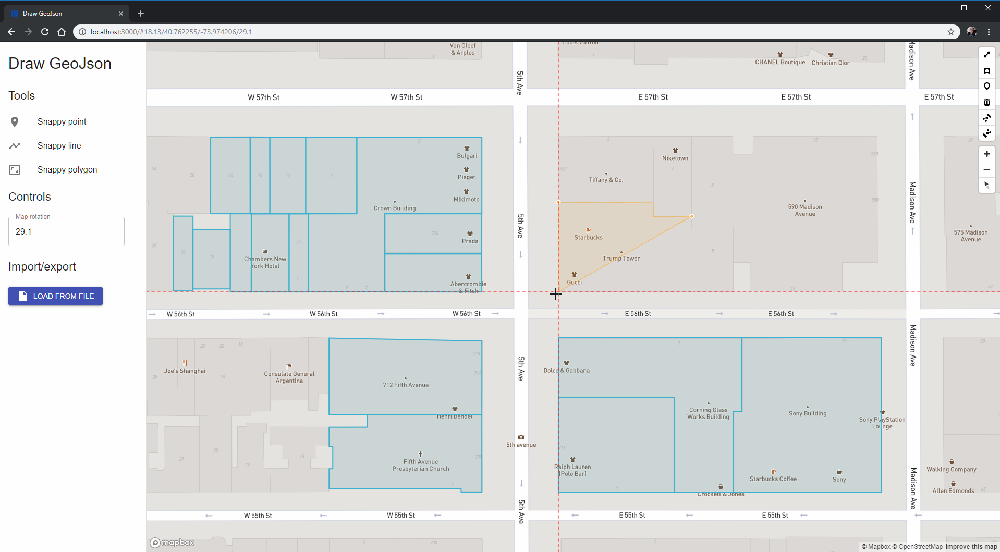

# Draw GeoJson

Draw precisely by snapping to other features.

This repo contains three custom [mapbox-gl-draw modes](https://github.com/mapbox/mapbox-gl-draw/blob/master/docs/MODES.md). They are extensions of the point, line and polygon tools. The difference is that they snap to other points on the page, and show guides when they do.

You can have a play at https://drawgeojson.firebaseapp.com.

The code for the modes is in [src/Map/snapModes](src/Map/snapModes).

## Some things you probably could have worked out on your own

This is all about drawing things with right angles. If you want to draw lakes, this is not the repo you are looking for.

Use the buttons on the left for the snap versions of the drawing tools. The original draw tools from mapbox-gl-draw are on the right.

First rotate the map so the thing you're drawing is aligned NSEW - the grid lines are horizontal/vertical, not tied to actual latitude/longitude.

Your cursor will snap to any other vertices that are currently on the screen. Vertices off the screen are ignored for performance reasons. The exception to this is the line or polygon you are drawing - all points from that feature will be snapped to, even if they're off screen.

You can pan and zoom as you work to control what will be snapped to.

You can even rotate while you work, for example to create a building where one wing is off on a 45 degree angle.

You can drop a few points on the map to artificially create points to snap to, if you like.

Currently only the drawing tools snap, there is no snapping when editing/moving existing features.

You can temporarily disable snapping by holding the alt key, handy for the curvy bits.
